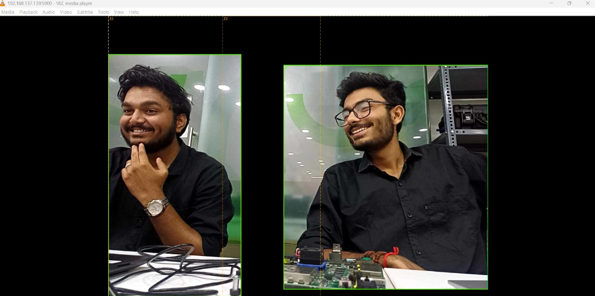
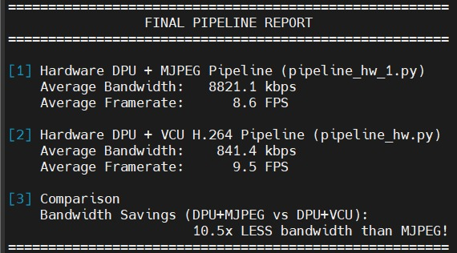
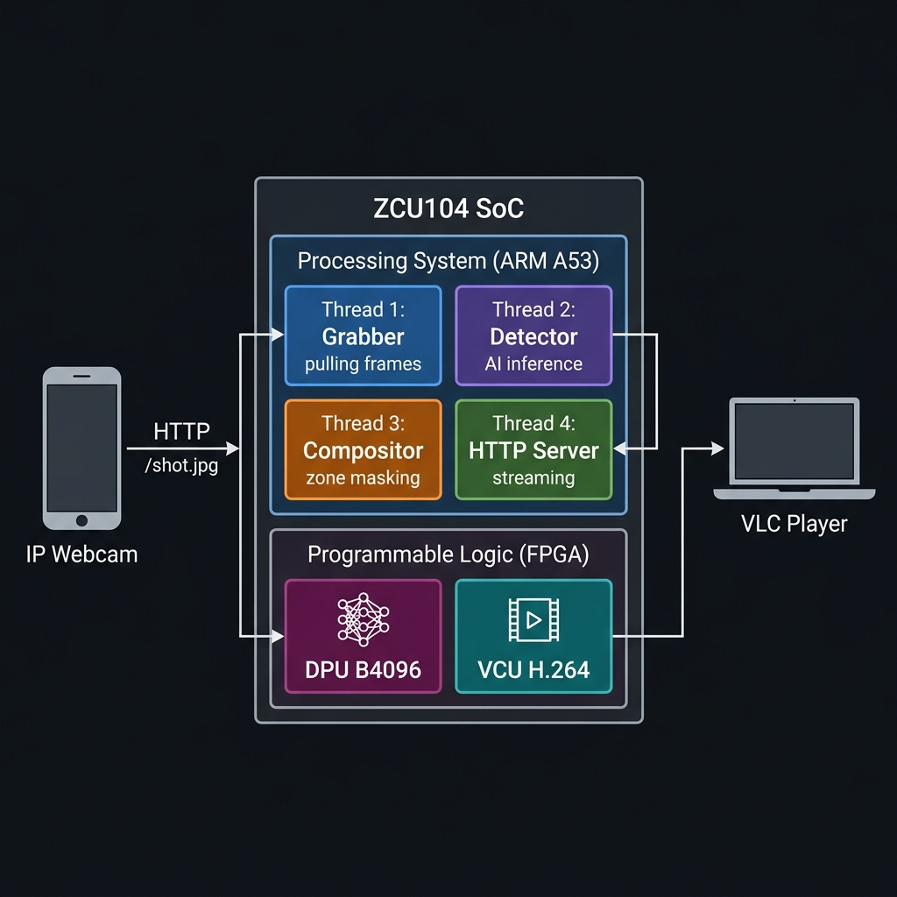
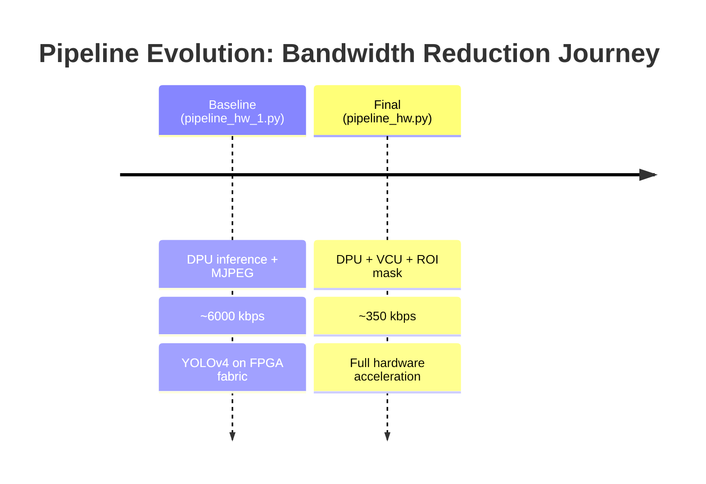
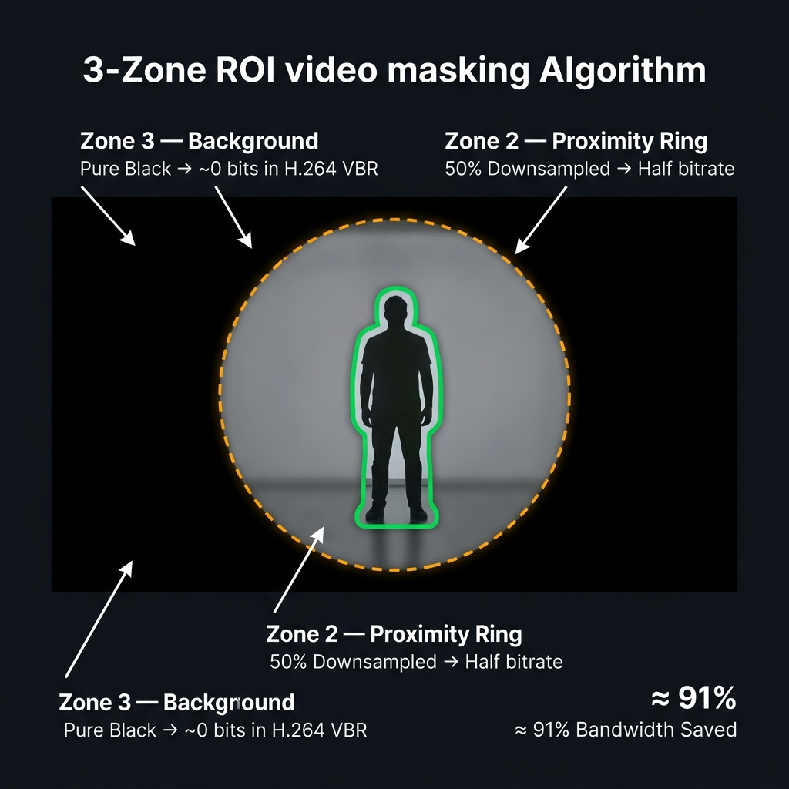

<div align="center">

# ZCU104 ROI Bandwidth Management

**Real-time person detection on FPGA fabric cuts video bandwidth by up to 85%.**  
YOLOv4 runs on the DPU. H.264 encodes on the VCU. The CPU is barely touched.

[](https://www.xilinx.com/products/boards-and-kits/zcu104.html)
[](docs/05_dpu_inference.md)
[](docs/06_vcu_encoding.md)
[](https://www.python.org/)
[](https://www.python.org/)
[](https://github.com/Xilinx/Vitis-AI)
[](LICENSE)


</div>



## 🎥 Watch it in Action

<div align="center">
  <a href="https://www.youtube.com/watch?v=sN2svjY858E">
    <br><br>
    
  </a>
  <br>
  <em>Click to watch the full technical breakdown and demonstration.</em>
</div>

---

## The Problem

A surveillance or robotics camera streaming raw video over a network wastes enormous bandwidth on background pixels that carry no useful information. On an embedded system like the ZCU104, that bandwidth is directly tied to power consumption, network congestion, and storage costs.

**This project proves, on real silicon, that:**
- A dedicated FPGA AI engine (DPU) can detect persons in real-time at the edge
- A 3-zone masking strategy: full-res ROI, half-res proximity ring, black background: makes the background nearly incompressible for an H.264 encoder
- The Xilinx VCU hardware H.264 encoder (Variable Bitrate mode) then exploits those black pixels to drop bandwidth dynamically with zero CPU overhead
---

## Benchmark Results

| Metric | DPU + MJPEG Baseline | DPU + VCU Hardware | Improvement |
|--------|----------------------|--------------------|-------------|
| Average Bandwidth | **8,821.1 kbps** | **841.4 kbps** | **10.5x Less Bandwidth** |
| Average Framerate | 8.6 FPS | 9.5 FPS | **+10% Faster** |



---

## Architecture



**Data flow:** Phone camera JPEG → OpenCV BGR → DPU (YOLOv4 INT8 inference) → bounding boxes → 3-zone compositor → MJPEG HTTP stream + VCU H.264 telemetry

See [Architecture Deep Dive →](docs/03_architecture.md)

---

## Project Evolution



---

## Quick Start: 10 Minutes to Live Stream

```
1. Flash ZCU104 with the Vitis AI TRD image
2. Copy project files to the board:
      scp -O -o HostKeyAlgorithms=+ssh-rsa <project>/* root@<board-ip>:/home/root/
3. Run preflight checks on the board:
      python3 preflight.py
4. Download the YOLOv4 DPU model (see docs/02_hardware_setup.md)
5. Start the pipeline:
      python3 pipeline_hw.py
6. Open VLC → Media → Open Network Stream:
      http://<board-ip>:5000/stream
```

> [!TIP]
> In VLC, go to **Tools → Preferences → Input/Codecs** and set **Network caching** to **150 ms** for the smoothest low-latency playback.

Full step-by-step guide: [Hardware Setup →](docs/02_hardware_setup.md)

---

## 3-Zone Algorithm

The core idea: make background pixels exactly zero, forcing H.264 VBR to allocate near-zero bits to them.



- **Zone 1**: Tight ROI around detected person, full resolution, motion-predictive padding- **Zone 2**: 1.6× proximity ring, downsampled to 50%, provides scene context- **Zone 3**: Pure black. An H.264 encoder in VBR mode spends nearly zero bits on solid black
Deep dive: [Zone Masking Algorithm →](docs/04_zone_masking_algorithm.md)

---

## Repository Map

<details>
<summary><strong>Click to expand file descriptions</strong></summary>

| File | Role |
|------|------|
| `pipeline_hw.py` | **Final: Full HW.** DPU inference + 3-zone mask + VCU H.264 (telemetry) + MJPEG HTTP stream |
| `pipeline_hw_1.py` | **Baseline.** DPU inference + 3-zone mask + MJPEG HTTP stream (no VCU encoding) |
| `zone_mask.py` | 3-zone masking engine: `build_zone_mask_multi()` + `draw_zone_overlay_multi()` |
| `adaptive_roi.py` | Motion-predictive ROI padding: expands bounding box asymmetrically in the direction of travel |
| `tracker.py` | `CentroidTracker`: exponential-weighted velocity smoothing over 8-frame history |
| `realBenchmark.py` | Automated benchmark runner: starts each pipeline, simulates a VLC client, collects telemetry |
| `telemetry.py` | Bandwidth telemetry helpers used by the pipelines |
| `preflight.py` | Hardware preflight checker: run before `pipeline_hw.py` to verify all dependencies |
| `export_yolo.py` | YOLOv4 model export utility |

</details>

---

## Documentation

| Doc | Contents |
|-----|----------|
| [01: Project Overview](docs/01_project_overview.md) | What, why, hypothesis, results summary |
| [02: Hardware Setup](docs/02_hardware_setup.md) | ZCU104, IP Webcam, wiring, SCP, SSH |
| [03: Architecture](docs/03_architecture.md) | System block diagram, thread model, data flow |
| [04: Zone Masking Algorithm](docs/04_zone_masking_algorithm.md) | 3-zone system, motion prediction, multi-target merging |
| [05: DPU Inference](docs/05_dpu_inference.md) | YOLOv4 on DPU, INT8 fix, RTLD_GLOBAL, RTTI crash |
| [06: VCU Encoding](docs/06_vcu_encoding.md) | H.264 hardware encoder, GStreamer pipeline, VBR mechanics |
| [07: Streaming Setup](docs/07_streaming_setup.md) | Running the pipeline, VLC config, URL format |
| [08: Benchmark Results](docs/08_benchmark_results.md) | Methodology, results table, bandwidth analysis |
| [09: Troubleshooting](docs/09_troubleshooting.md) | Every crash, every fix, prevention tips |

---

## Hardware

| Component | Detail |
|-----------|--------|
| **Board** | Xilinx ZCU104 Evaluation Kit |
| **SoC** | Zynq UltraScale+ MPSoC (ZU7EV) |
| **PS** | Quad-core ARM Cortex-A53 @ 1.2 GHz |
| **PL** | FPGA Fabric: hosts DPU + VCU |
| **DPU** | B4096: 4096 operations/cycle, INT8 inference |
| **VCU** | Dedicated H.264/H.265 hardware codec |
| **RAM** | 4 GB LPDDR4 |
| **OS** | PetaLinux (Vitis AI TRD 2020.2 image) |
| **Camera** | Android phone running IP Webcam app |

---

## License

MIT License: see [LICENSE](LICENSE).
