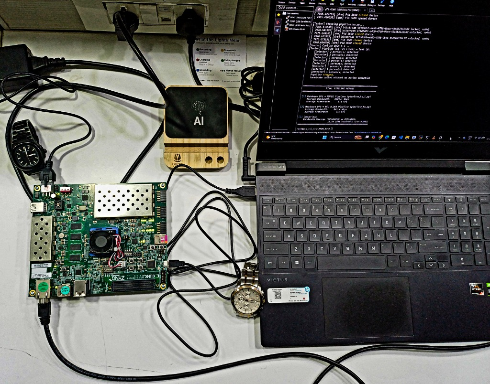

[← Project Overview](01_project_overview.md) | [↑ Back to README](../README.md) | [Next: Architecture →](03_architecture.md)

---

# 02: Hardware Setup

## Table of Contents
- [ZCU104 Board Overview](#zcu104-board-overview)- [Required Equipment](#required-equipment)- [Network Configuration](#network-configuration)- [Board Boot and SSH](#board-boot-and-ssh)- [IP Webcam App Setup](#ip-webcam-app-setup)- [Transferring Files to the Board](#transferring-files-to-the-board)- [Downloading the DPU Model](#downloading-the-dpu-model)- [Running Preflight Checks](#running-preflight-checks)
---

## ZCU104 Board Overview


The Xilinx ZCU104 is an evaluation kit for the Zynq UltraScale+ MPSoC family. Its distinguishing feature for this project is the **combined presence of both a DPU and a VCU** in a single device.

| Component | Specification |
|-----------|--------------|
| **SoC** | Zynq UltraScale+ ZU7EV |
| **Processing System (PS)** | Quad-core ARM Cortex-A53 @ 1.2 GHz |
| **Programmable Logic (PL)** | 504K LUTs, 1,728 DSP slices |
| **DPU** | B4096 deep learning accelerator (in PL fabric) |
| **VCU** | H.264 / H.265 hardware encoder/decoder (in PL fabric) |
| **RAM** | 4 GB LPDDR4 (PS-side) |
| **Storage** | MicroSD card (boot) + eMMC |
| **Networking** | 1 Gbps Ethernet (RJ45) |
| **USB** | USB 3.0 + USB-UART bridge (FTDI) |
| **OS** | PetaLinux: Vitis AI TRD 2020.2 image |

> [!NOTE]
> The **DPU** and **VCU** are both implemented in the **Programmable Logic (FPGA fabric)** of the SoC, not on the ARM CPU. This is what enables them to operate simultaneously without CPU resource contention.

---

## Required Equipment

| Item | Purpose | Notes |
|------|---------|-------|
| Xilinx ZCU104 board | Main compute platform | With power adapter |
| MicroSD card (≥8 GB) | Boot medium for PetaLinux | Class 10 or faster |
| Ethernet cable | Board ↔ router/switch | Or direct board ↔ laptop with ICS |
| USB-A to Micro-USB cable | UART console access | The FTDI port on the board |
| Android smartphone | Camera source | Must support IP Webcam app |
| Windows/Linux laptop | Development, SCP, VLC playback | |
| VLC Media Player | View the live stream | Free: [videolan.org](https://www.videolan.org/) |

---

## Network Configuration

All three devices (board, phone, laptop) must be on the **same subnet**.



### Typical IP Addresses

| Device | Role | IP in this project |
|--------|------|--------------------|
| ZCU104 board | Runs all pipelines | Find with `hostname -I` on the board |
| Android phone | Camera source (IP Webcam) | `192.168.2.141` ← update in `pipeline_hw.py` |
| Laptop | VLC client + SCP host | Any IP on the same subnet |

### Finding the Board's IP

After boot, either check your router's DHCP table, or connect via UART console first:

```bash
hostname -I
```

### Updating the Phone IP in the Code

Edit line 47 of `pipeline_hw.py`:

```python
PHONE_HOST = "192.168.2.141:8080"   # ← Change to your phone's IP
```

---

## Board Boot and SSH

### First Boot

1. Flash the **Vitis AI TRD 2020.2** PetaLinux image to the MicroSD card using Etcher or `dd`
2. Insert the MicroSD card into the ZCU104
3. Set boot mode switches to SD card boot (SW6: `1110`: check ZCU104 User Guide)
4. Connect Ethernet
5. Connect power: the board boots automatically

### UART Console (if SSH not available yet)

Connect the USB-UART cable and use a terminal emulator (PuTTY, Minicom, screen):
- **Baud rate:** 115200- **Data bits:** 8, Stop bits: 1, Parity: None
```bash
# Linux
screen /dev/ttyUSB0 115200

# Windows (PuTTY)
# COM port → Device Manager → Ports
```

### SSH

```bash
ssh root@<board-ip>
# Default password: root
```

> [!WARNING]
> The default password is `root`. Change it immediately on any network-connected deployment: `passwd root`

---

## IP Webcam App Setup

The camera source is an Android phone running the **IP Webcam** app by Pavel Khlebovich.

1. Install **IP Webcam** from Google Play Store (free)
2. Open the app
3. Scroll to the bottom: tap **"Start server"**
4. The app displays the stream URL: `http://<phone-ip>:8080`
5. In a browser on your laptop, go to `http://<phone-ip>:8080` to verify the feed works
6. The pipeline uses the `/shot.jpg` endpoint (JPEG snapshot polling): `http://<phone-ip>:8080/shot.jpg`

> [!TIP]
> Keep the phone plugged in (USB charging) during long runs: the screen staying on and active streaming will drain the battery quickly.

> [!NOTE]
> The pipeline polls `/shot.jpg` rather than using `/video` (MJPEG stream). This is intentional: snapshot polling has lower latency on Wi-Fi because each request is an independent HTTP GET, while an MJPEG stream over Wi-Fi can experience chunking from the phone's output buffer.

---

## Transferring Files to the Board

From your Windows laptop, use SCP to copy the project files:

```cmd
# Transfer ALL project Python files (run from the project folder)
scp -O -o HostKeyAlgorithms=+ssh-rsa ^
  pipeline_hw.py pipeline_hw_1.py pipeline.py ^
  realBenchmark.py zone_mask.py adaptive_roi.py ^
  tracker.py telemetry.py preflight.py ^
  root@192.168.137.176:/home/root/
```

> [!NOTE]
> The `-O` flag forces legacy SCP protocol. The `-o HostKeyAlgorithms=+ssh-rsa` flag is required because the ZCU104's PetaLinux SSH server uses an RSA host key that modern OpenSSH clients reject by default.

To transfer the model (if not already on the board):

```cmd
scp -O -o HostKeyAlgorithms=+ssh-rsa ^
  -r yolov4_leaky_spp_m/ ^
  root@192.168.137.176:/home/root/
```

---

## Downloading the DPU Model

> [!CAUTION]
> The model files (`.xmodel`, `.weights`) are excluded from this repository by `.gitignore`: they are too large for GitHub. You must download them separately.

The pipeline uses **YOLOv4 Leaky SPP** from the Xilinx Model Zoo, pre-compiled for the ZCU104 DPU architecture.

**On the board (recommended):**

```bash
# Download the ZCU104-specific model zoo archive
wget "https://www.xilinx.com/bin/public/openDownload?filename=yolov4_leaky_spp_m-zcu104-r3.0.0.tar.gz" \
     -O yolov4_model.tar.gz

# Extract
tar -xvf yolov4_model.tar.gz

# Verify the expected files exist
ls yolov4_leaky_spp_m/
# Expected: yolov4_leaky_spp_m.xmodel  meta.json
```

> [!WARNING]
> The `.xmodel` file is **architecture-specific**. A model compiled for ZCU102 will not run on ZCU104 and vice versa. Always use the `zcu104` model zoo variant.

---

## Running Preflight Checks

Before running any pipeline, always run the preflight checker. It verifies every dependency in under 10 seconds:

```bash
python3 preflight.py
```

**Expected output (all passing):**
```
============================================================
  ZCU104 ROI Pipeline: Preflight Check
============================================================

[1] Python packages
[PASS] vart (Vitis AI Runtime)
[PASS] xir (Xilinx IR)
[PASS] opencv-python (4.5.x)
[PASS] OpenCV built with GStreamer backend
[PASS] numpy (1.x.x)

[2] Local pipeline modules
[PASS] tracker.py exists
[PASS] adaptive_roi.py exists
[PASS] zone_mask.py exists

[3] DPU model files
[PASS] Model directory yolov4_leaky_spp_m/
[PASS] yolov4_leaky_spp_m/yolov4_leaky_spp_m.xmodel
[PASS] yolov4_leaky_spp_m/meta.json
[PASS] DPU subgraph found in .xmodel (1 subgraph(s))
[PASS] DPU runner created  (input: [1, 416, 416, 3])

[4] GStreamer plugins
[PASS] gst-inspect appsrc
[PASS] gst-inspect videoconvert
[WARN] omxh264enc (VCU) found: you CAN use hardware H.264.

[5] Network
[PASS] Ping phone (192.168.2.141)

[6] DPU hardware driver
[PASS] xdputil query (DPU driver alive)

============================================================
  All checks passed. Run: python3 pipeline_hw.py
============================================================
```

See [Troubleshooting →](09_troubleshooting.md) if any checks fail.

---

[← Project Overview](01_project_overview.md) | [↑ Back to README](../README.md) | [Next: Architecture →](03_architecture.md)
