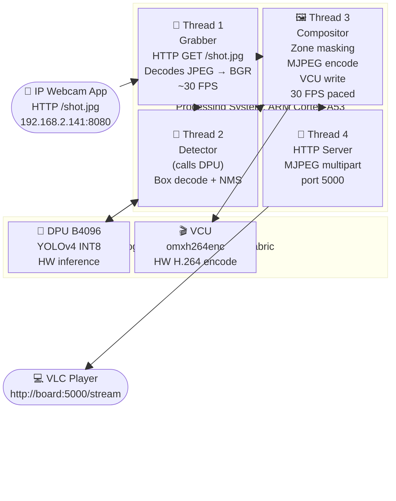
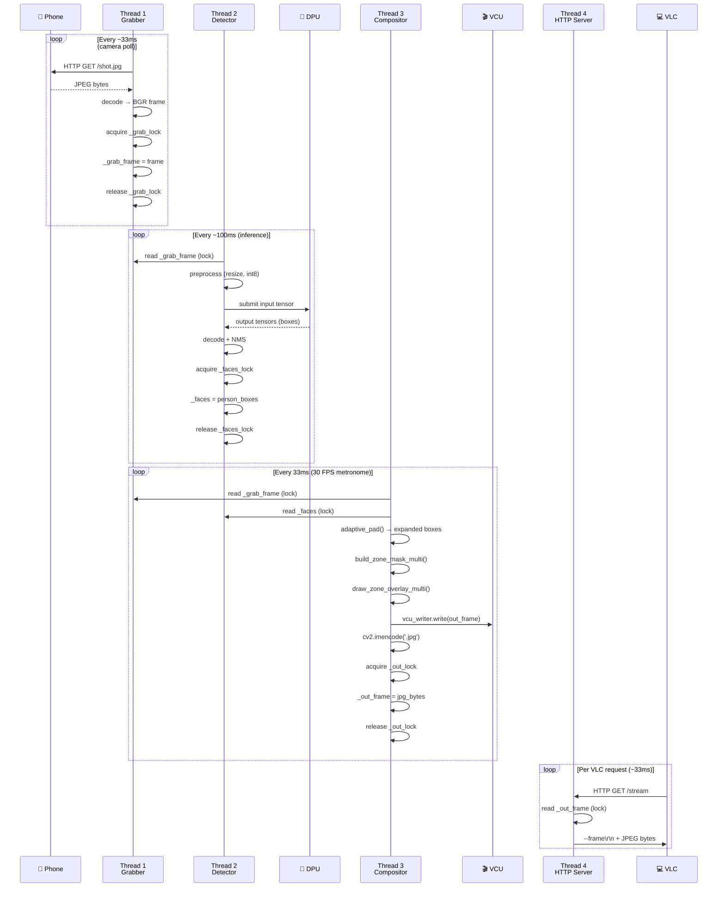

[← Hardware Setup](02_hardware_setup.md) | [↑ Back to README](../README.md) | [Next: Zone Masking →](04_zone_masking_algorithm.md)

---

# 03: System Architecture

## Table of Contents
- [High-Level Block Diagram](#high-level-block-diagram)
- [Thread Model](#thread-model)
- [Inter-Thread Data Flow (Sequence Diagram)](#inter-thread-data-flow)
- [Thread Synchronization](#thread-synchronization)
- [GStreamer Pipeline String](#gstreamer-pipeline-string)
- [Memory and Lock Architecture](#memory-and-lock-architecture)
---

## High-Level Block Diagram



---

## Thread Model

The pipeline runs four concurrent Python threads. Each thread has a single, focused responsibility.

| Thread | Name | Python Function | Runs On |
|--------|------|-----------------|---------|
| 1 | Grabber | `grabber_thread()` | ARM CPU |
| 2 | Detector | `detector_thread()` | ARM CPU (orchestrates DPU) |
| 3 | Compositor | `compositor_thread()` | ARM CPU (writes to VCU) |
| 4 | HTTP Server | `httpd.serve_forever()` | ARM CPU |

> [!NOTE]
> The **DPU** and **VCU** are hardware accelerators invoked *from* the ARM threads, not separate threads themselves. The DPU is called synchronously inside `detector_thread`, and the VCU is written to inside `compositor_thread` via OpenCV's GStreamer backend.

### Thread 1: Grabber

**Responsibility:** Keep `_grab_frame` fresh with the latest camera frame.

```
while True:
    HTTP GET http://phone:8080/shot.jpg
    decode JPEG bytes → numpy BGR array
    acquire _grab_lock → write _grab_frame
    release _grab_lock
    (no sleep: runs as fast as network allows)
```

### Thread 2: Detector

**Responsibility:** Run YOLOv4 inference on the DPU and keep `_faces` updated.

```
while True:
    read _grab_frame (under _grab_lock)
    preprocess: resize to 416×416, RGB, uint8-128 → int8
    submit to DPU runner (blocks until inference complete)
    decode output tensors → bounding boxes
    NMS (non-maximum suppression)
    filter class=person, conf > 0.30
    write _faces (under _faces_lock)
```

### Thread 3: Compositor

**Responsibility:** At exactly 30 FPS, composite the frame using the zone mask, push to VCU, encode to MJPEG for the HTTP server.

```
target_fps = 30, frame_time = 1/30
while True:
    loop_start = time.time()
    read _grab_frame
    read _faces → compute adaptive ROI boxes
    build_zone_mask_multi() → Zone 1/2/3 frame
    draw_zone_overlay_multi() → green/amber overlays
    write to VCU via vcu_writer.write(out)    ← hardware H.264 encode
    cv2.imencode('.jpg', out) → MJPEG bytes
    write to _out_frame (under _out_lock)     ← HTTP server reads this
    sleep(frame_time: elapsed)               ← pace to 30 FPS
```

### Thread 4: HTTP Server

**Responsibility:** Serve the MJPEG multipart stream to any connected client (VLC, browser).

```
for each GET /stream request:
    send multipart/x-mixed-replace header
    while client connected:
        read _out_frame (under _out_lock)
        write --frame boundary
        write Content-Type + Content-Length headers
        write JPEG bytes
        sleep(0.033)    ← ~30 FPS cap
```

---

## Inter-Thread Data Flow



---

## Thread Synchronization

Three shared memory locations, each protected by a dedicated lock:

| Shared State | Lock | Written by | Read by |
|-------------|------|-----------|---------|
| `_grab_frame` | `_grab_lock` | Grabber (Thread 1) | Detector (Thread 2), Compositor (Thread 3) |
| `_faces` | `_faces_lock` | Detector (Thread 2) | Compositor (Thread 3) |
| `_out_frame` | `_out_lock` | Compositor (Thread 3) | HTTP Server (Thread 4) |

> [!TIP]
> All locks use `threading.Lock()` (non-reentrant). Acquisitions are always short (just a pointer swap), so there is no realistic deadlock risk. The Compositor reads `_grab_frame` and `_faces` in separate, non-overlapping lock windows.

> [!WARNING]
> Never hold `_grab_lock` and `_faces_lock` simultaneously: even though no current code does this, it would create a potential deadlock if Grabber and Detector ever need to take them in opposite order.

---

## GStreamer Pipeline String

The `GST_OUT` string in `pipeline_hw.py` defines the VCU encoding pipeline. Here it is broken down element by element:

```
appsrc ! videoconvert ! video/x-raw,format=NV12 ! omxh264enc control-rate=variable target-bitrate=1500 ! fakesink sync=false
```

| Element | What it does | Key Parameters | Why it's here |
|---------|-------------|---------------|---------------|
| `appsrc` | Accepts raw frame data pushed from Python (`cv2.VideoWriter.write()`) | *(none)* | Entry point: bridges Python → GStreamer |
| `videoconvert` | Converts the frame's color space | *(auto-detects)* | OpenCV outputs BGR; the VCU encoder requires NV12 (planar YUV 4:2:0) |
| `video/x-raw,format=NV12` | Caps filter: enforces NV12 output from videoconvert | `format=NV12` | Tells the next element exactly what pixel format to expect |
| `omxh264enc` | **The VCU Hardware H.264 Encoder.** Runs on dedicated silicon, zero CPU. | `control-rate=variable`: Variable Bitrate mode<br/>`target-bitrate=1500`: 1500 kbps target | The entire point of the pipeline: hardware H.264 with VBR that naturally drops bandwidth for black regions |
| `fakesink` | Discards the encoded H.264 bytes | `sync=false`: don't pace to clock | We are using VCU encoding for telemetry (bandwidth measurement), not for streaming. Smooth visualization is served as MJPEG via the HTTP server. |

> [!NOTE]
> `sync=false` on `fakesink` is critical. Without it, GStreamer tries to pace the output to a presentation clock, which introduces exactly the batching/buffering delays that caused the "pause → fast-forward → pause" problem during earlier development.

---

## Memory and Lock Architecture

```
┌─────────────────────────────────────────────────────────────────┐
│                     Python Process Memory                        │
│                                                                  │
│  _grab_frame ←──── [numpy array, BGR, ~1920×1080×3 bytes]       │
│  _grab_lock  ←──── threading.Lock()                             │
│                                                                  │
│  _faces      ←──── [list of (x,y,w,h) tuples, 0–5 items]       │
│  _faces_lock ←──── threading.Lock()                             │
│                                                                  │
│  _out_frame  ←──── [bytes, JPEG-encoded, ~60–130 KB]            │
│  _out_lock   ←──── threading.Lock()                             │
│                                                                  │
│  vcu_writer  ←──── cv2.VideoWriter (GStreamer backend)          │
│                    → omxh264enc (DMA into VCU hardware)          │
└─────────────────────────────────────────────────────────────────┘
```

The VCU writes happen through OpenCV's GStreamer backend via **DMA (Direct Memory Access)** from the LPDDR4 RAM directly into the VCU hardware registers. The ARM CPU is not involved in the actual H.264 encoding computation.

---

[← Hardware Setup](02_hardware_setup.md) | [↑ Back to README](../README.md) | [Next: Zone Masking →](04_zone_masking_algorithm.md)
