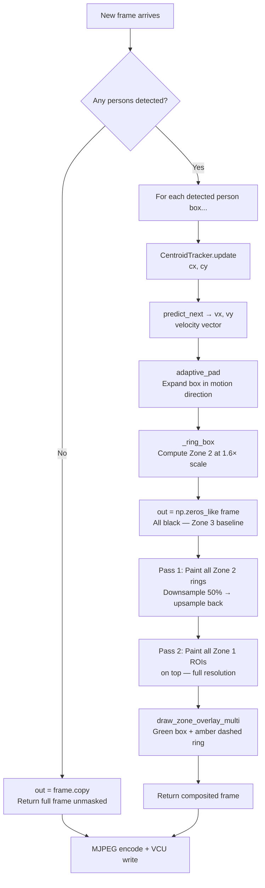

[← Architecture](03_architecture.md) | [↑ Back to README](../README.md) | [Next: DPU Inference →](05_dpu_inference.md)

---

# 04 — Zone Masking Algorithm

## Table of Contents
- [Core Idea](#core-idea)
- [Zone Definitions](#zone-definitions)
- [Why Black Pixels Save Bandwidth](#why-black-pixels-save-bandwidth)
- [Zone Construction (ASCII Diagram)](#zone-construction)
- [Masking Decision Flowchart](#masking-decision-flowchart)
- [Multi-Target Merging](#multi-target-merging)
- [Motion-Predictive ROI — `adaptive_roi.py`](#motion-predictive-roi)
- [Centroid Tracker — `tracker.py`](#centroid-tracker)
- [Caching Optimization](#caching-optimization)

---

## Core Idea

The zone masking algorithm answers a single question: **"For each pixel in the output frame, what is the most information-efficient value to assign it?"**

- Pixels around a detected person: **full resolution** — every detail matters
- Pixels in the surrounding area: **half resolution** — context matters, but coarsely
- All other pixels: **pure black (0x000000)** — maximum compression, zero perceptual loss

By making background pixels exactly zero before H.264 encoding, we exploit a fundamental property of block-based video codecs: **DCT coefficients of uniform regions (especially zero) encode to nearly zero bits in VBR mode.**

---

## Zone Definitions

| Zone | Region | Resolution | Color in Overlay |
|------|--------|-----------|-----------------|
| **Zone 1** | Tight bounding box around detected person (+ motion padding) | **Full resolution** — every pixel preserved exactly | 🟢 Solid green rectangle |
| **Zone 2** | 1.6× expanded ring around Zone 1 | **50% downsampled** then upsampled back — blurred, half the detail | 🟡 Dashed amber rectangle |
| **Zone 3** | Everything else | **Pure black (0x000000)** | No overlay |

---

## Why Black Pixels Save Bandwidth

H.264 encodes video in **8×8 or 16×16 macroblocks**. For each macroblock, it computes a **Discrete Cosine Transform (DCT)**, which converts spatial pixel values into frequency coefficients.

For a macroblock that is **solid black (all zeros)**:
- All DCT coefficients are exactly 0
- After quantization: all coefficients remain 0
- After entropy coding (CABAC/CAVLC): the entire macroblock encodes to a handful of bits — essentially just a "skip" flag

In **VBR (Variable Bitrate)** mode, the encoder automatically allocates fewer bits to easy macroblocks and more to complex ones. Zone 3 (pure black) macroblocks are the easiest possible case — they approach **zero bits per macroblock**.

This is the mechanism behind the bandwidth savings:

```
Scene with 2 persons covering 15% of frame:
  Zone 1 pixels  : ~5% of frame  → full quality → ~full bitrate
  Zone 2 pixels  : ~10% of frame → half quality → ~half bitrate  
  Zone 3 pixels  : ~85% of frame → pure black   → ~0 bitrate
  
  Effective bandwidth ≈ (0.05 × 1.0 + 0.10 × 0.5 + 0.85 × 0.0) × baseline
                      ≈ 0.10 × baseline
                      ≈ 90% reduction
```

---

## Zone Construction

```
Input frame (1920×1080 example):
┌────────────────────────────────────────────────────┐
│                                                    │
│                                                    │
│              ┌──────────────────────┐              │
│              │   Zone 2 Ring        │              │
│              │   (1.6× bbox scale)  │              │
│              │   50% downsampled    │              │
│              │    ┌──────────┐      │              │
│              │    │  Zone 1  │      │              │
│              │    │  Full    │      │              │
│              │    │  Res.    │      │              │
│              │    │  Person  │      │              │
│              │    └──────────┘      │              │
│              └──────────────────────┘              │
│                                                    │
│         Zone 3: Pure Black (0x000000)              │
│                                                    │
└────────────────────────────────────────────────────┘

In the output numpy array:
  out = np.zeros_like(frame)          ← Start: everything is black (Zone 3)
  out[ring_area] = downsampled_pixels ← Apply Zone 2 (blurred)
  out[roi_area]  = frame[roi_area]    ← Apply Zone 1 on top (exact pixels)
  
  Zone 1 always wins — painted last, overwrites Zone 2 where they overlap.
```

---

## Masking Decision Flowchart



---

## Multi-Target Merging


When multiple persons are detected simultaneously, zones from all targets are merged onto a single canvas.

The merging strategy is a **two-pass painter's algorithm**:

```python
# Pass 1: Paint ALL Zone 2 rings first (lower priority)
for (ax, ay, aw, ah) in adapted_boxes:
    rx, ry, rw, rh = _ring_box(ax, ay, aw, ah, fw, fh)
    z2_src = frame[ry:ry+rh, rx:rx+rw]
    small  = cv2.resize(z2_src, (sw, sh), cv2.INTER_AREA)    # downsample
    z2_up  = cv2.resize(small, (rw, rh), cv2.INTER_LINEAR)   # upsample
    out[ry:ry+rh, rx:rx+rw] = z2_up

# Pass 2: Paint ALL Zone 1 ROIs on top (highest priority)
for (ax, ay, aw, ah) in adapted_boxes:
    out[ay:ay+ah, ax:ax+aw] = frame[ay:ay+ah, ax:ax+aw]
```

**Why two passes?** If you interleave Zone 1 and Zone 2 per-target, a Zone 2 ring from target B could overwrite the Zone 1 ROI of target A when they overlap. By painting all Zone 2 rings first and all Zone 1 ROIs last, Zone 1 always wins for any overlapping region.

---

## Motion-Predictive ROI — `adaptive_roi.py`

Raw YOLO bounding boxes are too tight — a person moving at the edge of the box would exit Zone 1 and suddenly appear in Zone 3 (black). To prevent this, `adaptive_pad()` expands the box asymmetrically in the predicted direction of motion:

```python
def adaptive_pad(x, y, w, h, vx, vy, frame_w, frame_h,
                 base_pad=20, vel_scale=3.0, max_expand=80):
    
    # Directional padding: expand MORE in the direction of travel
    pad_left   = base_pad + clamp(max(0, -vx) * vel_scale, max_expand)
    pad_right  = base_pad + clamp(max(0,  vx) * vel_scale, max_expand)
    pad_top    = base_pad + clamp(max(0, -vy) * vel_scale, max_expand)
    pad_bottom = base_pad + clamp(max(0,  vy) * vel_scale, max_expand)
    
    # Apply padding and clamp to frame boundaries
    ...
```

| Parameter | Default | Effect |
|-----------|---------|--------|
| `base_pad` | 20 px | Minimum padding on every side regardless of velocity |
| `vel_scale` | 3.0 | Extra pixels of padding per pixel/frame of velocity |
| `max_expand` | 80 px | Hard cap — prevents the box exploding for a fast-moving person |

**Example:** A person moving right at 15 px/frame gets `pad_right = 20 + 15×3 = 65 px` on the right side, but only `pad_left = 20 px` on the left. The Zone 1 box leads the person.

---

## Centroid Tracker — `tracker.py`

`adaptive_pad()` needs `(vx, vy)` — the velocity of the target. `CentroidTracker` computes this from the detection centroid history.

```python
class CentroidTracker:
    def __init__(self, history=8):
        self._history = deque(maxlen=8)   # ring buffer of (vx, vy)
        self._prev_cx = None
        self._prev_cy = None
    
    def update(self, cx, cy):
        if self._prev_cx is not None:
            self.vx = cx - self._prev_cx   # instantaneous velocity
            self.vy = cy - self._prev_cy
            self._history.append((self.vx, self.vy))
        self._prev_cx, self._prev_cy = cx, cy
    
    def smooth_velocity(self):
        # Exponential-weighted mean: recent frames have more weight
        n = len(self._history)
        weights = np.exp(np.linspace(-1.0, 0.0, n))
        weights /= weights.sum()
        ...
```

**Why exponential weighting?** A person who was moving fast but just stopped shouldn't be padded aggressively — the exponentially weighted average gives much higher weight to the last 1–2 frames than to frames 7–8 frames ago, making the velocity estimate responsive to changes in motion.

> [!NOTE]
> One `CentroidTracker` instance is maintained **per target slot** (up to `MAX_TARGETS=5`). If a person disappears, `tracker.reset()` clears the history so stale velocity doesn't affect the next person detected in that slot.

---

## Caching Optimization

The compositor caches the last-computed zone boxes so that when detection results haven't changed (same person, same position), it only repaints the pixels without recomputing all the geometry:

```python
if faces_key != last_faces_key:
    # New detection — full recompute (adaptive_pad + zone_mask + overlay)
    ...
    cached_boxes   = adapted_boxes
    cached_rings   = ring_boxes
    last_faces_key = faces_key
else:
    # Same boxes, new pixels — fast recomposite without geometry recompute
    out = np.zeros_like(frame)
    for (ax, ay, aw, ah) in cached_boxes:
        out[ay:ay+ah, ax:ax+aw] = frame[ay:ay+ah, ax:ax+aw]
    out = draw_zone_overlay_multi(out, cached_boxes, cached_rings)
```

`faces_key` is a tuple-of-tuples of the raw bounding box coordinates. If the detection hasn't changed, we skip `adaptive_pad()` and `build_zone_mask_multi()` — both of which involve NumPy resize operations — and go straight to the fast pixel copy.

---

[← Architecture](03_architecture.md) | [↑ Back to README](../README.md) | [Next: DPU Inference →](05_dpu_inference.md)
