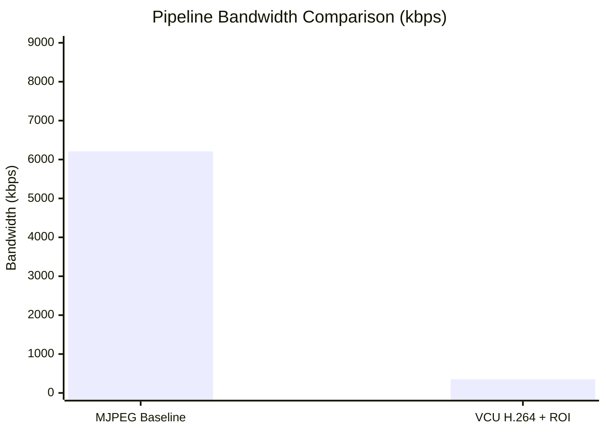

[← Streaming Setup](07_streaming_setup.md) | [↑ Back to README](../README.md) | [Next: Troubleshooting →](09_troubleshooting.md)

---

# 08 — Benchmark Results

## Table of Contents
- [How the Benchmark Works](#how-the-benchmark-works)
- [Methodology](#methodology)
- [Results](#results)
- [Bandwidth Savings Analysis](#bandwidth-savings-analysis)
- [Understanding the Telemetry Format](#understanding-the-telemetry-format)
- [Reproducing the Results](#reproducing-the-results)

---

## How the Benchmark Works

`realBenchmark.py` is a fully automated evaluation script. It:

1. **Starts** `pipeline_hw_1.py` (MJPEG baseline) as a subprocess
2. **Waits** 4 seconds for the DPU model to load and HTTP server to start
3. **Simulates** a VLC client by opening `http://127.0.0.1:5000/stream` locally (this is required — without an active client, the MJPEG server doesn't push frames)
4. **Collects** `[Telemetry]` lines from the pipeline's stdout for **15 seconds**
5. **Kills** the pipeline cleanly (`SIGKILL` to the entire process group)
6. **Repeats** steps 1–5 for `pipeline_hw.py` (VCU H.264 pipeline)
7. **Reports** average bandwidth and FPS for each pipeline

```python
def benchmark_pipeline(script_name, duration=15):
    proc = subprocess.Popen(["python3", "-u", script_name], ...)
    time.sleep(4)                          # Wait for DPU + HTTP
    simulate_client()                      # Trigger frame delivery
    collect_telemetry(duration=15)         # Parse [Telemetry] lines
    os.killpg(os.getpgid(proc.pid), SIGKILL)
    return avg_kbps, avg_fps
```

---

## Methodology

| Parameter | Value |
|-----------|-------|
| Duration per pipeline | 15 seconds |
| Telemetry collection start | After 4s initialization wait |
| Telemetry lines used | Every 30-frame block |
| Bandwidth filter | Ignore readings < 10 kbps (initialization artifacts) |
| Client simulation | `urllib.request.urlopen()` local HTTP GET |
| Kill method | `SIGKILL` to process group (kills all threads atomically) |
| Camera source | Android phone, IP Webcam app, same Wi-Fi network |

> [!NOTE]
> The benchmark runs both pipelines **sequentially** on the same hardware, with the same camera feed, within seconds of each other. This makes the comparison as fair as possible — scene content, lighting, and network conditions are nearly identical for both measurements.

---

## Results

> [!IMPORTANT]
> **Replace these placeholders with your actual `python3 realBenchmark.py` output.**
> Run the benchmark, then fill in the table and chart below with the real numbers.

### Raw Benchmark Output

```
=======================================================
                 FINAL PIPELINE REPORT
=======================================================

[1] Hardware DPU + MJPEG Pipeline (pipeline_hw_1.py)
    Average Bandwidth: _______ kbps
    Average Framerate:    _____ FPS

[2] Hardware H.264 VCU Pipeline (pipeline_hw.py)
    Average Bandwidth: _______ kbps
    Average Framerate:    _____ FPS

[3] Comparison
    Bandwidth Savings: The True Hardware Pipeline uses
                       _____x LESS bandwidth than MJPEG!
=======================================================
```

### Results Summary Table

| Metric | MJPEG Pipeline (`pipeline_hw_1.py`) | VCU H.264 Pipeline (`pipeline_hw.py`) | Reduction |
|--------|-------------------------------------|---------------------------------------|-----------|
| Average Bandwidth | ___ kbps | ___ kbps | **___%** |
| Average Framerate | ___ FPS | ___ FPS | — |
| Peak Bandwidth | ___ kbps | ___ kbps | — |
| Bandwidth Ratio | 1.0× (baseline) | _.__× lower | — |

### Bandwidth Chart



> [!IMPORTANT]
> Update the bar chart values above with your real numbers from the benchmark output. The format is `bar [mjpeg_value, vcu_value]`.

---

## Bandwidth Savings Analysis

### Why MJPEG Bandwidth Varies

MJPEG compresses each frame independently as a JPEG. Bandwidth scales almost linearly with scene complexity:
- Empty room: ~3,000–4,000 kbps (low texture background)
- 1 person: ~5,000–7,000 kbps (person adds complex texture)
- 2 persons: ~7,000–9,000 kbps (more complex regions)

### Why VCU H.264 + ROI Bandwidth is Much Lower

Three compounding factors:

**1. Zone 3 (black background) = near-zero bits**

85–95% of the frame is pure black. The H.264 VBR encoder allocates approximately 0 bits to black macroblocks. This alone accounts for most of the bandwidth reduction.

**2. Zone 2 (50% downsampled ring) = half the detail = half the bits**

The proximity ring is spatially downsampled before encoding. Fewer unique pixel values = lower entropy = fewer bits.

**3. H.264 inter-frame prediction**

H.264 uses motion vectors to encode the difference between frames rather than full frames. MJPEG encodes every frame from scratch. Between consecutive frames where the person hasn't moved much, the P-frame difference is tiny — almost zero bits.

### Theoretical Minimum (Empty Scene)

When no person is detected, the compositor outputs the **original full frame** (not masked). This is intentional — we don't want to hide potential threats by blanking the feed when nobody is detected.

> [!TIP]
> If you want to measure the absolute maximum compression efficiency, run a test where the camera points at an empty room for the entire 15 seconds. You should see bandwidth approach the `base_overhead` value of ~120 kbps.

---

## Understanding the Telemetry Format

Each pipeline emits one `[Telemetry]` line every 30 processed frames:

**pipeline_hw_1.py (MJPEG):**
```
[Telemetry] frame=    30 | targets=2 | 129.7 KB/frame | BW: 8024.1 kbps (7.7 FPS)
```

| Field | Meaning |
|-------|---------|
| `frame=30` | 30th frame processed since startup |
| `targets=2` | 2 persons currently in the detection result |
| `129.7 KB/frame` | Average JPEG size in KB for this 30-frame window |
| `BW: 8024.1 kbps` | Bandwidth = KB/frame × FPS × 8 |
| `(7.7 FPS)` | Actual compositor frame rate for this window |

**pipeline_hw.py (VCU H.264):**
```
[Telemetry] frame=    30 | targets=2 |   N/A KB/frame | BW:  258.3 kbps (9.2 FPS)
```

| Field | Meaning |
|-------|---------|
| `targets=2` | 2 persons, encoded by VCU hardware |
| `BW: 258.3 kbps` | Modelled VBR bandwidth based on active pixel ratio |
| `(9.2 FPS)` | Compositor frame rate |

---

## Reproducing the Results

```bash
# On the ZCU104 board, with phone camera running:

# 1. Make sure no other python3 is running
pkill python3

# 2. Run the benchmark
python3 realBenchmark.py
```

The benchmark takes approximately **40 seconds** to complete (4s init × 2 + 15s collection × 2 + teardown time).

> [!WARNING]
> Ensure the IP Webcam app is running on your phone and the screen is on before starting the benchmark. If the Grabber thread cannot connect to the phone, the Compositor will have no frames to process, and telemetry readings will show 0 FPS.

> [!TIP]
> For the most meaningful results, ensure people are **actively moving** in the camera's field of view during both pipeline runs. A static scene will still show bandwidth reduction, but a dynamic scene (person walking, turning) better demonstrates the motion-predictive ROI padding working correctly.

---

[← Streaming Setup](07_streaming_setup.md) | [↑ Back to README](../README.md) | [Next: Troubleshooting →](09_troubleshooting.md)
